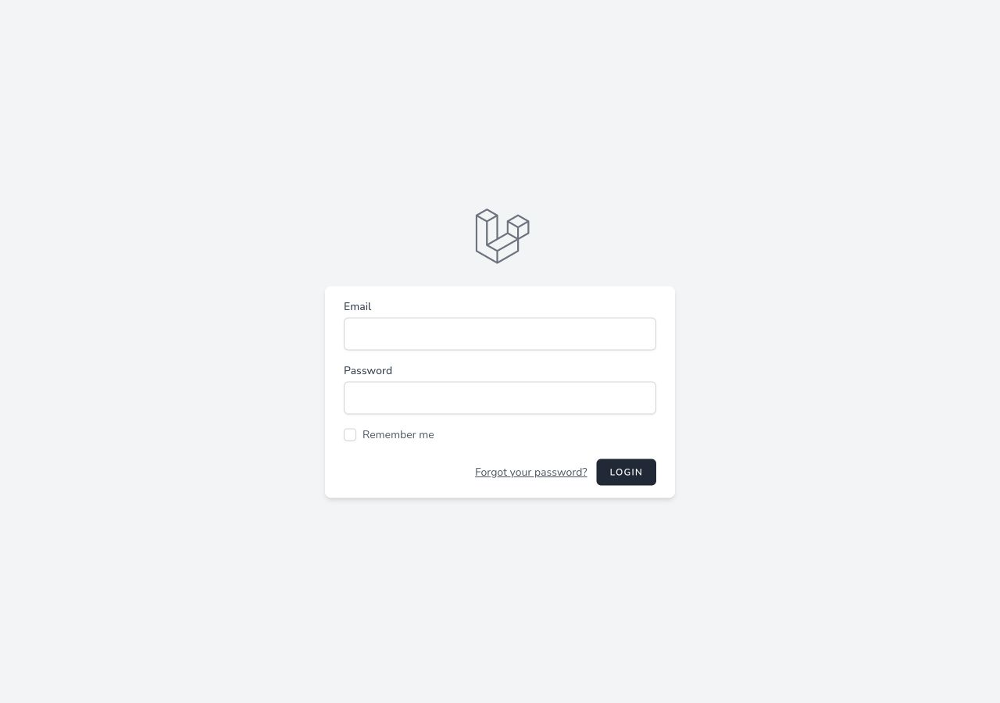
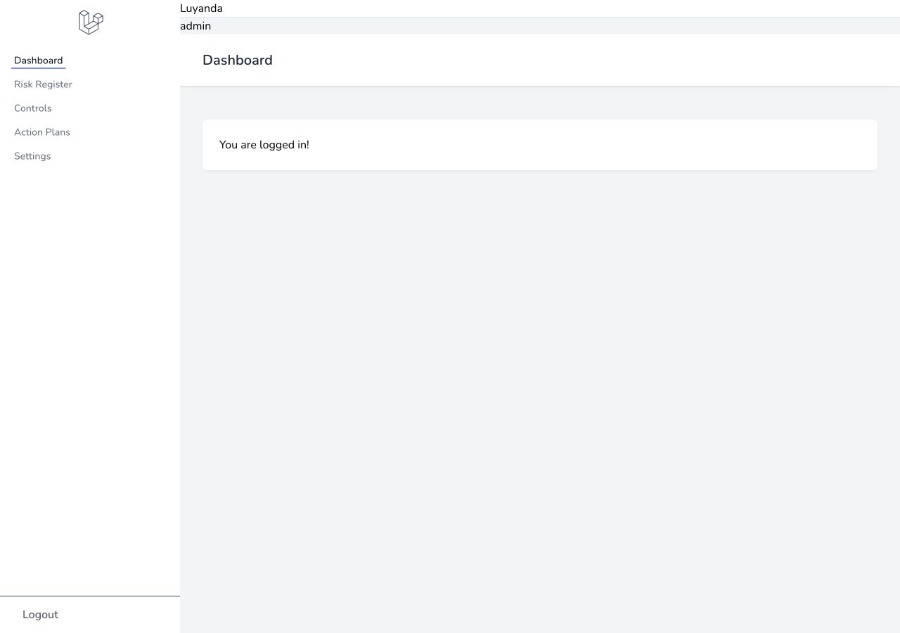
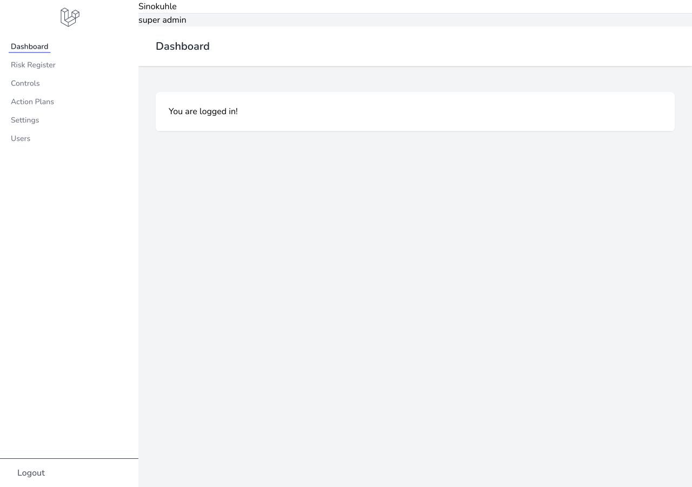

# Risk Management / RBAC Local Verification

## 2026-07-09

This verification used a temporary SQLite database so the local MySQL setup was not changed.

Temporary database:

```text
/tmp/risk-management-proof.sqlite
```

## Environment

- PHP 8.5.6
- Laravel 11.11.1
- Composer 2.9.8
- Node.js 24.16.0
- npm 11.13.0
- Next.js 14.2.3

## Commands Run

Backend migration and seed:

```bash
rm -f /tmp/risk-management-proof.sqlite
touch /tmp/risk-management-proof.sqlite
APP_ENV=local APP_DEBUG=true DB_CONNECTION=sqlite DB_DATABASE=/tmp/risk-management-proof.sqlite php artisan migrate:fresh --seed
```

Result:

- Passed.
- Created users, roles, permissions, personal access tokens, cache, jobs, and Spatie permission tables.
- Seeded `admin` and `super admin` users.

Frontend install and checks:

```bash
npm install
npm run lint
npm run build
```

Result:

- `npm install` completed.
- `npm run lint` passed with no ESLint warnings or errors.
- `npm run build` passed.
- npm audit reported 24 vulnerabilities: 1 low, 11 moderate, 10 high, 2 critical.
- Build warned that Browserslist/caniuse data is outdated.

Backend tests:

```bash
APP_ENV=local APP_DEBUG=true DB_CONNECTION=sqlite DB_DATABASE=/tmp/risk-management-proof.sqlite php artisan test
```

Result:

- 1 unit test passed.
- Existing Breeze feature tests failed under the current runtime/configuration.
- PHP 8.5 emitted dependency deprecation warnings from older Laravel ecosystem packages.

## Auth And RBAC Proof

Backend server was started with clean PHP response output:

```bash
APP_ENV=local \
APP_DEBUG=false \
APP_URL=http://localhost:8000 \
FRONTEND_URL=http://localhost:3000 \
SANCTUM_STATEFUL_DOMAINS=localhost:3000 \
SESSION_DOMAIN=localhost \
DB_CONNECTION=sqlite \
DB_DATABASE=/tmp/risk-management-proof.sqlite \
php -d display_errors=0 -d error_reporting=8191 -S 127.0.0.1:8000 -t public
```

Frontend server:

```bash
NEXT_PUBLIC_BACKEND_URL=http://localhost:8000 npm run dev
```

### Admin User

Credentials:

```text
Email: Luyanda@gmail.com
Password: password
```

Direct Sanctum API verification:

- `/sanctum/csrf-cookie` returned `204`.
- `/login` returned `204`.
- `/api/user` returned `200`.
- User role: `admin`.
- Permissions returned:
  - `view dashboard`
  - `view risks`
  - `view controls`
  - `view action plans`
  - `view settings`

### Super Admin User

Credentials:

```text
Email: Sinokuhle@gmail.com
Password: password
```

Direct Sanctum API verification:

- `/sanctum/csrf-cookie` returned `204`.
- `/login` returned `204`.
- `/api/user` returned `200`.
- User role: `super admin`.
- Permissions returned:
  - `view dashboard`
  - `view risks`
  - `view controls`
  - `view action plans`
  - `view settings`
  - `manage users`

## Browser Verification

Browser opened:

```text
http://localhost:3000/login
```

Verified:

- Login form renders.
- Email field is visible.
- Password field is visible.
- Remember me checkbox is visible.
- Login button is visible.
- Admin login succeeds in the frontend.
- Admin is redirected to `/dashboard`.
- Admin dashboard shows `Luyanda` with role `admin`.
- Admin sidebar does not show the `Users` link.
- Super admin login succeeds in the frontend.
- Super admin is redirected to `/dashboard`.
- Super admin dashboard shows `Sinokuhle` with role `super admin`.
- Super admin sidebar shows the `Users` link from the `manage users` permission.

Screenshots:





### Browser Auth Notes

- The first Browser login attempt failed while the backend was served through `php artisan serve` on PHP 8.5 because dependency deprecation output polluted local responses.
- The proof run succeeded after serving Laravel with PHP deprecation display disabled and after starting Next.js with `NEXT_PUBLIC_BACKEND_URL=http://localhost:8000`.
- This confirms the frontend auth flow, role labels, and role-aware sidebar rendering.

## Important Findings

- The backend RBAC foundation is real and verified through the API.
- Admin and super admin users have different permission scopes.
- The frontend can authenticate both seeded roles and render different navigation by permission scope.
- The backend now includes a first real risk-domain workflow through a permission-protected risk register API.
- The frontend is still mostly a Breeze/Next auth shell, not a complete risk-management product UI.
- The backend currently emits PHP 8.5 deprecation output under the default local serve path. This should be cleaned up before treating the project as production-ready.
- The frontend dependency tree needs a security upgrade pass before this project is promoted strongly.

## Risk Register API Proof

Added and verified on 2026-07-09:

- `risks` table with owner relationship, title, description, category, likelihood, impact, residual scoring fields, status, identified date, and reviewed date.
- `Risk` model with `owner` relationship and score helpers.
- `RiskResource` with owner details, inherent score, residual score, status, category, and dates.
- `RiskService` for list, create, update, and delete workflow operations.
- `RiskController` stays thin and delegates domain work to the service.
- `StoreRiskRequest` and `UpdateRiskRequest` validate the API payload and check the `view risks` permission.
- `/api/risks` resource routes are protected by `auth:sanctum` and `permission:view risks`.
- `RiskSeeder` adds three demo risks for the seeded admin/super-admin users.

Focused test command:

```bash
rm -f /tmp/risk-register-api-proof.sqlite
touch /tmp/risk-register-api-proof.sqlite
APP_ENV=testing DB_CONNECTION=sqlite DB_DATABASE=/tmp/risk-register-api-proof.sqlite \
  php artisan test tests/Feature/RiskRegisterApiTest.php
```

Result:

- Passed.
- 3 tests.
- 19 assertions.
- Verified guest users cannot access `/api/risks`.
- Verified authenticated users without `view risks` are forbidden.
- Verified admin users can create, list, show, update, and delete a risk.
- Verified calculated `inherent_score` and `residual_score` in API output.

Formatting command:

```bash
vendor/bin/pint --dirty
```

Result:

- Passed.
- Fixed style in changed PHP files.
- PHP 8.5 deprecation warnings still appear from older dependency versions.
